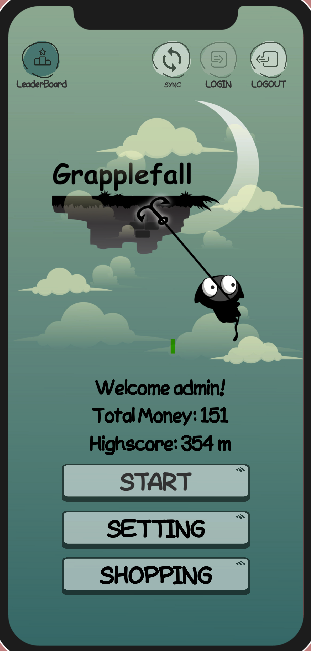
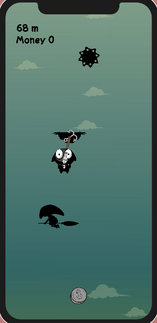
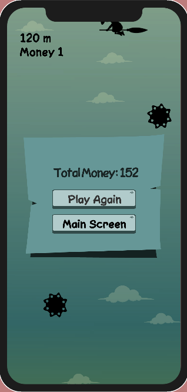
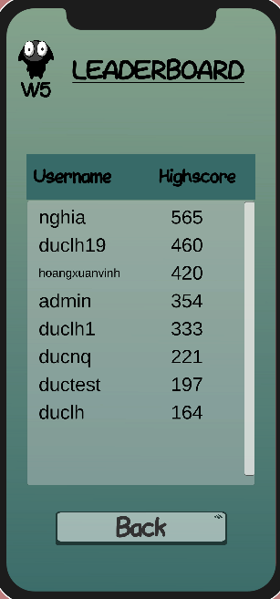

# Introduction to Software Engineering - Group W5
## Vertical Platformer Game

The game is similar to a platformer game but vertically. The character will be in a free fall and must find a way to move across vertical platforms using grappling hooks. Besides, players also have to fight monsters and avoid obstacles.

---
### Demonstration

    
    

    
    

--- 

### Installation 
#### Users:
- For Android users:  ``.apk``  is available in [here](https://drive.google.com/file/d/1FrbPY7p3_MOtXq_UIV3P5Il3hs0dGQUR/view?usp=drive_link). 
- For IOS users: Sorry, there is no publicly available version, please contact the authors for more information.

#### Developer:

-  We use [Editor Unity](https://unity.com/) and [Firebase SDK_11.1.0](https://husteduvn-my.sharepoint.com/:u:/g/personal/duc_nq204876_sis_hust_edu_vn/EX0vzO7iFNpLr3aO0zOZP4oBEQu5C9KzhNhIMcn2MdsCIw?e=tcxBPc) with FirebaseAuth and FirebaseDatabase and for our project.

### Folder Organization

- This folder has the same structure as a typical Unity project.

### Member information 

| Member ID | Full Name       | Student ID    |  Github|
| :--:|    :---:              |   :---:       | :---:|
| 1   | Nguyen Quang Duc      | 20204876      |https://github.com/qducnguyen|
| 2   | Le Hong Duc           | 20204874      |https://github.com/duclh19 |
| 3   | Tran Le Phuong Thao   | 20200604      |https://github.com/TranafLee |
| 4   | La Dai Lam            | 20204918      |https://github.com/ladailam382 |
| 5   | Luu Trong Nghia       | 20204888      |https://github.com/nghialt0205 |
| 6   | Hoang Van An          | 20204864      |https://github.com/EthAnHoangg |

### For questions and more information, please contact me at duc.nq204876@sis.hust.edu.vn
